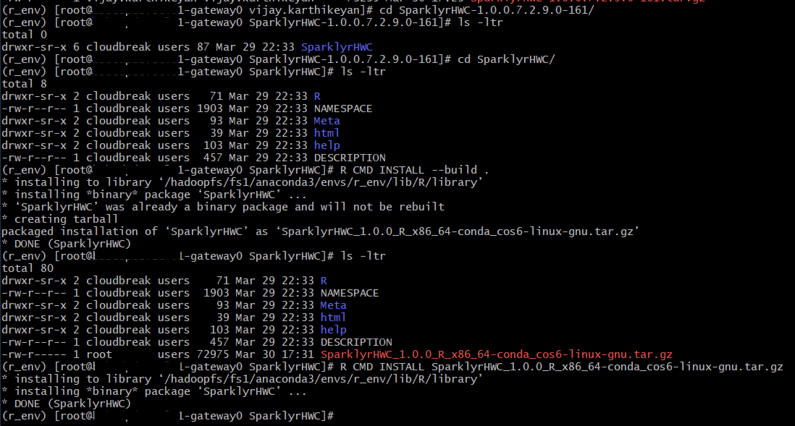

# SparklyR Examples

## Setup R environment
* Directory creation
    ```
    mkdir /hadoopfs/fs1/anaconda3
    chown root:cdp-admins /hadoopfs/fs1/anaconda3
    chmod 775 /hadoopfs/fs1/anaconda3
    setfacl -d -m group:cdp-admins:rwx /hadoopfs/fs1/anaconda3
    ```
* Install Anaconda from [website](https://www.anaconda.com/products/individual) & point the install to the existing directory `/hadoopfs/fs1/anaconda3`
    ```
    bash Anaconda3-2020.11-Linux-x86_64.sh -u
    ```
* Create Environment - Run the following on the gateway node. `cdp-users` group will need to provide the entire conda path - `sudo /hadoopfs/fs1/anaconda3/bin/conda`
    ```
    conda create -y -n r_env r r-essentials r-base r-sparklyr conda-pack
    conda activate r_env
    conda install -c conda-forge r-xgboost r-arrow
    ```
* To package the R environment for run the following command
    ```
    cd /hadoopfs/fs1/anaconda3/envs/
    conda pack -o /hadoopfs/fs1/r_env.tar.gz -d ./r_env
    ```
* All users should now be able to run the following access. Use sudo only if you are running in to issues with installing additional packages. `cdp-users` group will need to provide the entire conda path - `sudo /hadoopfs/fs1/anaconda3/bin/conda`
    ```
    conda activate r_env
    conda deactivate
    ```

## Execute SparklyR jobs on YARN
Create a Bash script to source the environment before kicking off the job.
```
#!/bin/bash
source /hadoopfs/fs1/anaconda3/etc/profile.d/conda.sh
conda activate r_env
Rscript <script-name>.R
```

## Install custom version of SparklyrHWC
